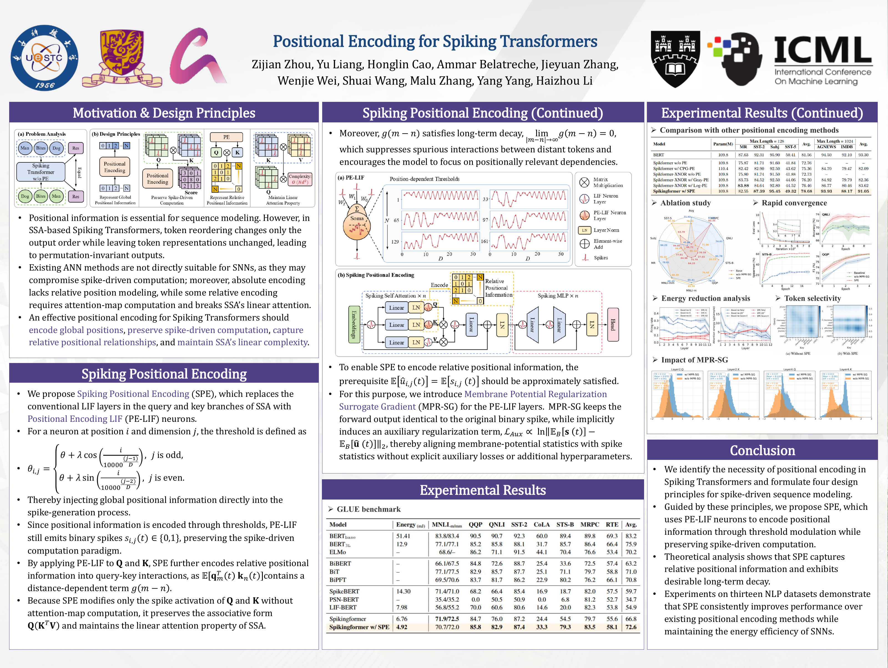

<div align="center">

<h1>SPE: Positional Encoding for Spiking Transformers</h1>

<p>
  <a href="https://proceedings.mlr.press/v306/zhou26ab.html"></a>
  <a href="https://raw.githubusercontent.com/mlresearch/v306/main/assets/zhou26ab/zhou26ab.pdf"></a>
  <a href="assets/SPE_ICML2026_poster.pdf"></a>
  <a href="https://modelscope.cn/models/kailai1104/SPE"></a>
</p>

<p>
  Zijian Zhou, Yu Liang, Honglin Cao, Ammar Belatreche, Jieyuan Zhang,<br />
  Wenjie Wei, Shuai Wang, Malu Zhang, Yang Yang, Haizhou Li
</p>

<p><b>Official implementation of "Positional Encoding for Spiking Transformers" (ICML 2026).</b></p>

</div>

## News

- `Oct. 2026` Pre-training, fine-tuning, and evaluation code, together with the [pre-trained checkpoint](https://modelscope.cn/models/kailai1104/SPE), are available! 🚀
- `Sep. 2026` Our paper is available in the [ICML 2026 proceedings](https://proceedings.mlr.press/v306/zhou26ab.html)! 🎉

## Overview

**Spiking Positional Encoding (SPE)** encodes positional information directly into the spike-generation process of Spiking Transformers. It is designed around four principles: represent global positions, preserve spike-driven computation, capture relative positional relationships, and maintain the linear attention property of spiking self-attention (SSA).

SSA needs positional signals to distinguish token order. Positional encodings inherited from ANNs can interfere with binary spike computation or require explicit attention maps, motivating an encoding tailored to Spiking Transformers.

SPE introduces two components:

- **Positional Encoding Leaky Integrate-and-Fire (PE-LIF) neurons:** Replace the LIF neurons in the query and key branches with neurons whose thresholds vary with position. Sinusoidal threshold modulation injects positional information while keeping the outputs binary. Query-key interactions capture relative position and exhibit long-term decay, without adding trainable parameters.
- **Membrane Potential Regularization Surrogate Gradient (MPR-SG):** Aligns batch-mean membrane-potential and spike statistics during training. It preserves the original spikes in the forward pass and induces regularization through the surrogate gradient, without an explicit auxiliary loss.

For the released implementation's attention evaluation order and checkpoint compatibility details, see the [implementation notes](docs/reproduction.md#fine-tuning).

<p align="center">
  <a href="assets/SPE_ICML2026_poster.pdf">
    
  </a>
</p>

<p align="center"><a href="assets/SPE_ICML2026_poster.pdf">View the full-resolution poster (PDF)</a></p>

## Main Results on GLUE

Results on the **GLUE development sets**, as reported in the paper and poster. MNLI is shown as matched/mismatched; energy is reported in mJ. Scores and averages follow the paper's evaluation protocol.

| Model | Energy (mJ) | MNLI-m/mm | QQP | QNLI | SST-2 | CoLA | STS-B | MRPC | RTE | Avg. |
| :--- | ---: | :---: | ---: | ---: | ---: | ---: | ---: | ---: | ---: | ---: |
| BERT-base | 51.41 | 83.8/83.4 | 90.5 | 90.7 | 92.3 | 60.0 | 89.4 | 89.8 | 69.3 | 83.2 |
| BERT-3L | 12.9 | 77.1/77.1 | 85.2 | 85.8 | 88.1 | 31.7 | 85.7 | 86.4 | 66.4 | 75.9 |
| ELMo | - | 68.6/- | 86.2 | 71.1 | 91.5 | 44.1 | 70.4 | 76.6 | 53.4 | 70.2 |
| BiBERT | - | 66.1/67.5 | 84.8 | 72.6 | 88.7 | 25.4 | 33.6 | 72.5 | 57.4 | 63.2 |
| BiT | - | 77.1/77.5 | 82.9 | 85.7 | 87.7 | 25.1 | 71.1 | 79.7 | 58.8 | 71.0 |
| BiPFT | - | 69.5/70.6 | 83.7 | 81.7 | 86.2 | 22.9 | 80.2 | 76.2 | 66.1 | 70.8 |
| SpikeBERT | 14.30 | 71.4/71.0 | 68.2 | 66.4 | 85.4 | 16.9 | 18.7 | 82.0 | 57.5 | 59.7 |
| PSN-BERT | - | 35.4/35.2 | 0.0 | 50.5 | 50.9 | 0.0 | 6.8 | 81.2 | 52.7 | 34.7 |
| LIF-BERT | 7.98 | 56.8/55.2 | 70.0 | 60.6 | 80.6 | 14.6 | 20.0 | 82.3 | 53.8 | 54.9 |
| Spikingformer | 6.76 | 71.9/72.5 | 84.7 | 76.0 | 87.2 | 24.4 | 54.5 | 79.7 | 55.6 | 66.8 |
| **Spikingformer w/ SPE (Ours)** | **4.92** | **70.7/72.0** | **85.8** | **82.9** | **87.4** | **33.3** | **79.3** | **83.5** | **58.1** | **72.6** |

> SPE improves the average GLUE score from **66.8 to 72.6** (+5.8 points) while reducing reported energy from **6.76 to 4.92 mJ** (27.2%).

## Main Results on Text Classification

Accuracy (%) on six text classification benchmarks. The four short-text tasks use a maximum sequence length of **128**; AGNEWS and IMDB use **1024**.

| Model | Param (M) | MR | SST-2 | Subj | SST-5 | Avg. (128) | AGNEWS | IMDB | Avg. (1024) |
| :--- | ---: | ---: | ---: | ---: | ---: | ---: | ---: | ---: | ---: |
| BERT | 109.8 | 87.63 | 92.31 | 95.90 | 50.41 | 81.56 | 94.50 | 92.10 | 93.30 |
| Spikformer w/o PE | 109.8 | 75.87 | 81.71 | 91.60 | 41.84 | 72.76 | - | - | - |
| Spikformer w/ CPG-PE | 110.4 | 82.42 | 82.90 | 92.50 | 43.62 | 75.36 | 84.70 | 79.47 | 82.09 |
| Spikformer-XNOR w/o PE | 109.8 | 75.80 | 81.74 | 91.50 | 41.88 | 72.73 | - | - | - |
| Spikformer-XNOR w/ Gray-PE | 109.8 | 83.73 | 84.52 | 92.50 | 44.06 | 76.20 | 84.92 | 79.79 | 82.36 |
| Spikformer-XNOR w/ Log-PE | 109.8 | 83.88 | 84.64 | 92.80 | 44.52 | 76.46 | 86.77 | 80.46 | 83.62 |
| **Spikingformer w/ SPE (Ours)** | **109.8** | **82.55** | **87.39** | **95.45** | **49.32** | **78.68** | **93.93** | **88.17** | **91.05** |

> SPE achieves average accuracies of **78.68%** on short-text tasks and **91.05%** on long-text tasks, exceeding Log-PE by **2.22** and **7.43** points, respectively, without additional trainable parameters.

## Pre-trained Checkpoint

Download the released weights, configuration, and tokenizer from **[ModelScope: kailai1104/SPE](https://modelscope.cn/models/kailai1104/SPE)**.

| Model | Encoder | Time Steps | Pre-training Length | Training Step | Download |
| :--- | :---: | :---: | :---: | :---: | :---: |
| SPE-110M | 12 layers, 768 hidden units, 12 heads | 4 | 128 | 650,000 | [ModelScope](https://modelscope.cn/models/kailai1104/SPE) |

The release contains the original weights and matching configuration/tokenizer. Full settings, the SHA256 checksum, and checkpoint validation records are in the [reproduction guide](docs/reproduction.md#released-checkpoint).

## Quick Start

### Requirements and Installation

The released implementation was validated with **Python 3.10**, **PyTorch 2.8.0**, **Transformers 4.57.0**, **SpikingJelly 0.0.0.0.14**, and **CuPy 13.0.0** on an NVIDIA H100. Keep the pinned Transformers version because the model uses its internal interfaces.

```bash
git clone https://github.com/CayleyZ/SPE.git
cd SPE
pip install -r requirements.txt

# Install the CuPy wheel matching your CUDA runtime; this is for CUDA 12.x.
pip install cupy-cuda12x==13.0.0

# Download the released checkpoint.
pip install modelscope_hub
python -c "from modelscope_hub import HubApi; HubApi().download_repo('kailai1104/SPE', 'model', local_dir='checkpoints/SPE')"
```

For CPU inference or small runs, use `--neuron_backend torch`; evaluation also requires `--device cpu`.

### Data Preparation

- **Pre-training:** TinyStories, BookCorpus, CC-News, OpenWebText, and Wikipedia. Use raw Hugging Face datasets with a `text` column, or a tokenized `DatasetDict` saved with `save_to_disk()` and containing `train` and `validation` splits.
- **GLUE:** CoLA, SST-2, MRPC, STS-B, QQP, MNLI, QNLI, and RTE. The fine-tuning script loads these tasks through Hugging Face Datasets and evaluates on their development splits.
- **Text classification:** MR, SST-5, Subj, AGNEWS, and IMDB. The fine-tuning script uses the provided test splits. Local datasets can be supplied with `--dataset_path`.

See the [data and pre-training instructions](docs/reproduction.md#pre-training) for the expected tokenized fields and raw-corpus preparation.

### Pre-training

Set the tokenized corpus path and GPU count, then launch the main MLM pre-training configuration:

```bash
TOKENIZED_DATASET=/path/to/128_tokenized_data NUM_GPUS=8 \
  bash scripts/pretrain.sh
```

The main setting uses a sequence length of 128, a global batch size of 512, an MLM probability of 0.15, and 650,000 optimizer steps. Raw-corpus training and checkpoint resumption are described in the [reproduction guide](docs/reproduction.md#pre-training).

### Fine-tuning

```bash
# GLUE tasks
MODEL_PATH=checkpoints/SPE bash scripts/finetune.sh sst2
MODEL_PATH=checkpoints/SPE bash scripts/finetune.sh mnli

# Long-text classification tasks
MODEL_PATH=checkpoints/SPE bash scripts/finetune.sh ag_news
MODEL_PATH=checkpoints/SPE bash scripts/finetune.sh imdb
```

The launcher uses batch size 32 and learning rate 2e-5. The best checkpoint is saved to `<output_dir>/best`, with metrics in `all_results.json`. See [fine-tuning details](docs/reproduction.md#fine-tuning) for all supported tasks, epoch defaults, and sequence-length handling.

### Checkpoint Evaluation

Run the same five-sample SST-2 pseudo-perplexity check recorded for the released weights:

```bash
python evaluate_mlm.py \
  --model_name_or_path checkpoints/SPE \
  --mode pseudo --dataset_name nyu-mll/glue --dataset_config_name sst2 \
  --split validation --num_samples 5 --max_length 128 \
  --output results/pseudo_ppl.json
```

The recorded pseudo-PPL is **12.1288614031** for 5 samples / 77 tokens. This is a checkpoint compatibility check. The paper's downstream results above are reported separately; full downstream training was not repeated for the release. See [validation protocols and recorded checks](docs/reproduction.md#verify-the-weights) for masked MLM perplexity and loading verification.

### Direct Inference

```python
import torch
from transformers import AutoTokenizer
from spikingjelly.activation_based import functional
from checkpoint_utils import load_mlm

path = "checkpoints/SPE"
tokenizer = AutoTokenizer.from_pretrained(path)
model, report = load_mlm(path)
model.cuda().eval()
batch = tokenizer("Spiking positional encoding is [MASK].", return_tensors="pt")
with torch.no_grad():
    logits = model(**{key: value.cuda() for key, value in batch.items()}).logits
functional.reset_net(model)
```

Use the custom SPE loader: `AutoModelForMaskedLM` would instantiate ordinary BERT. Reset spiking neuron states between independent batches; the provided training and evaluation scripts do this automatically.

## Repository Layout

```text
assets/                          ICML 2026 poster (PNG preview and original PDF)
docs/reproduction.md             Detailed reproduction and checkpoint validation
spikingbert_pelif_simsig_stable.py Checkpoint-compatible spiking BERT model
pelif_simsig_stable.py            PE-LIF neurons and MPR-SG
checkpoint_utils.py              Strict MLM and classification checkpoint loading
pretrain.py                      MLM pre-training
finetune.py                      GLUE and text classification fine-tuning
evaluate_mlm.py                  Masked PPL and pseudo-PPL evaluation
configs/spe_110m.json             Released architecture and neuron parameters
scripts/                        Main experiment launchers
validation/                     Recorded checkpoint verification
```

## Citation

If you use SPE in your research, please cite our [ICML 2026 paper](https://proceedings.mlr.press/v306/zhou26ab.html):

```bibtex
@inproceedings{zhou2026spe,
  title     = {Positional Encoding for Spiking Transformers},
  author    = {Zhou, Zijian and Liang, Yu and Cao, Honglin and Belatreche, Ammar and
               Zhang, Jieyuan and Wei, Wenjie and Wang, Shuai and Zhang, Malu and
               Yang, Yang and Li, Haizhou},
  booktitle = {Proceedings of the 43rd International Conference on Machine Learning},
  series    = {Proceedings of Machine Learning Research},
  volume    = {306},
  pages     = {165320--165338},
  publisher = {PMLR},
  year      = {2026},
  url       = {https://proceedings.mlr.press/v306/zhou26ab.html}
}
```

## License

This repository is released under the **Apache 2.0 License**. The BERT implementation retains its upstream copyright notices. See [LICENSE](LICENSE) and [NOTICE](NOTICE).
